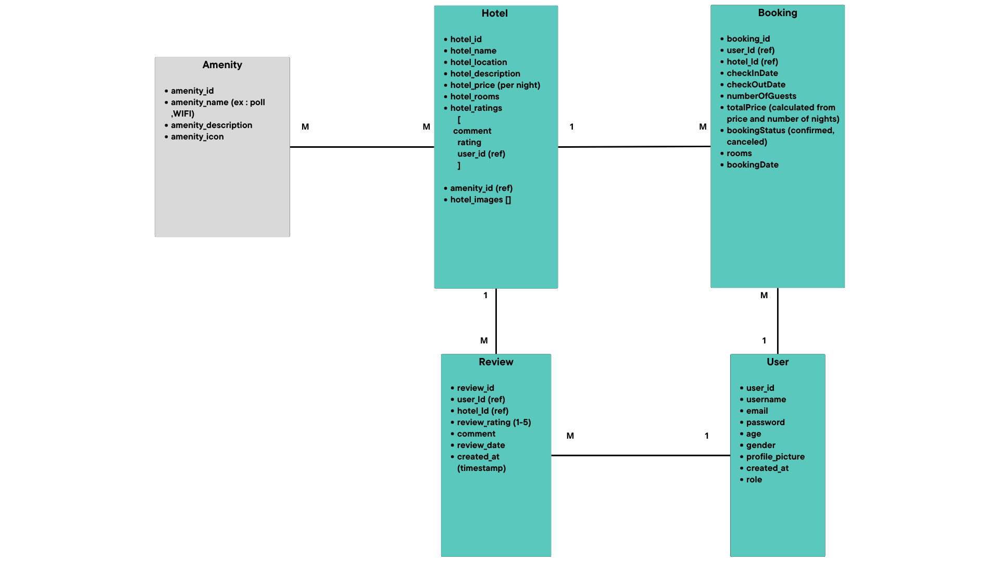
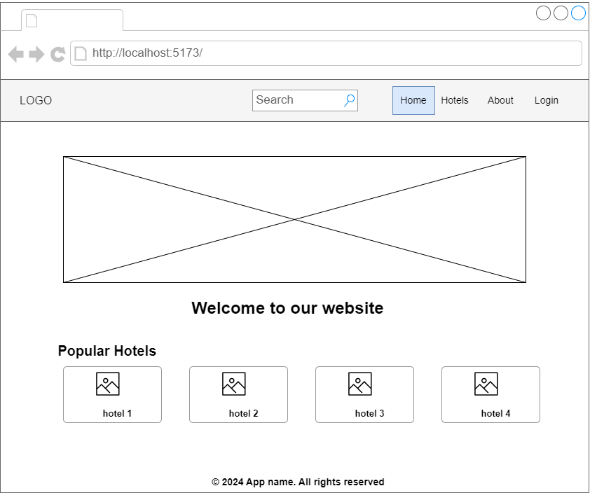
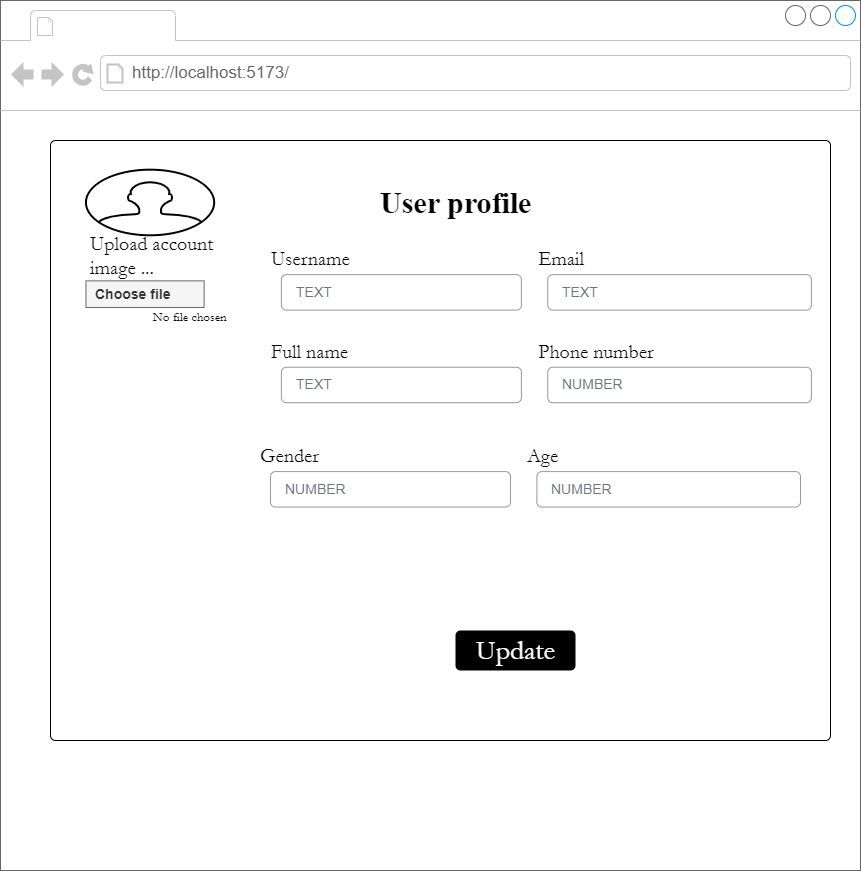
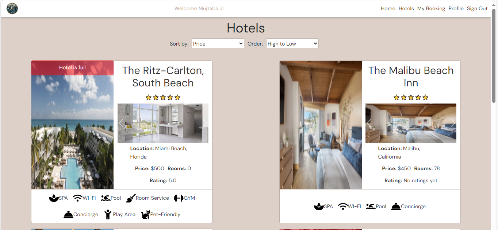
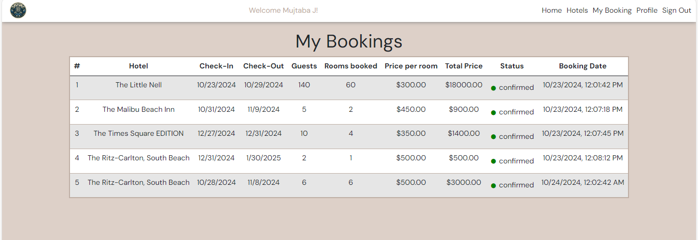
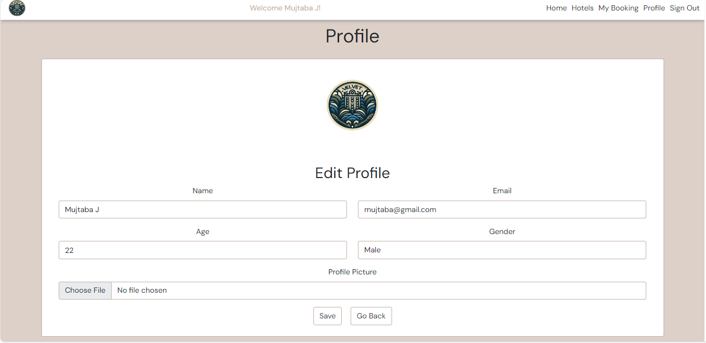

# Velvet Hotels 
## Date: 20/10/2024
## By: Mujtaba Jameel || Hussain Aliwi || Ali Alhaddar || Jaffer Mohammed
####  [GitHub](https://github.com/Mujtaba18/VelvetHotels-FE) 

***
### ***_Description_***
#### **A hotel booking app that simplifies searching, comparing, and booking hotel , offering user-friendly features for travelers worldwide.** 

***

### ***_Technologies Used_***
* React
* Express js 
* MongoDB 
* JavaScript 
* HTML
* CSS 
* Bootstrap
***

### ***Application users***
* User
* Admin

***

### ***Entity Relationship Diagram (ERD)***
<!-- ##### Sign up and sign in as a new user and then begin viewing the different sections of the website.
##### A Trello board was used to keep track of development progress and can be viewed [here](https://getnave.com/blog/trello-kanban-boards).
##### The project was deployed and can be viewed [here](https://www.namecheap.com/market). -->

***

***

### ***Component Hierarchy Diagram***

***

***
### ***Wireframes***

***

***

### ***Main Screenshots***

***

***

***

***

***

### ***_Future Updates_***
- [ ] Payment method

***
### ***_Credits_***
##### Images: [GeeksforGeeks](https://www.geeksforgeeks.org)
##### Markdown Guide: [MDN](https://developer.mozilla.org/en-US/docs/Web/JavaScript)
##### API Testing: [Insomnia](https://insomnia.rest/)

***